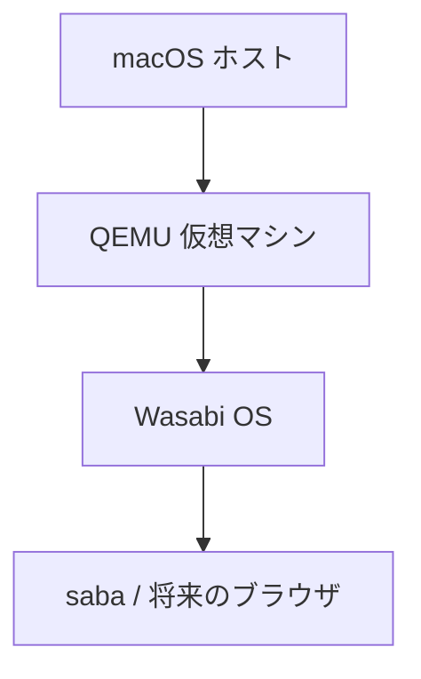
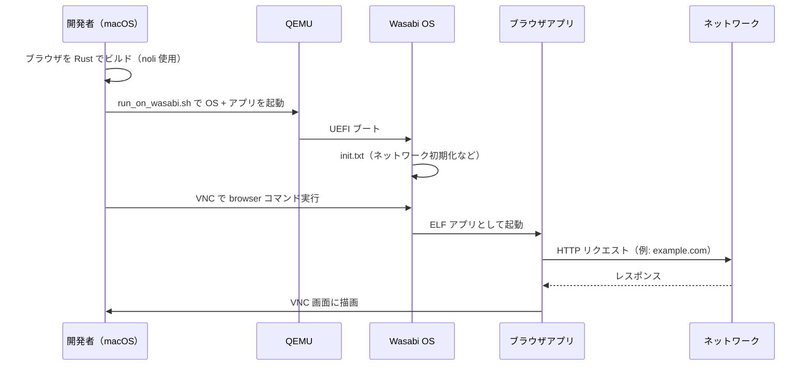

# web-browser-lab

Wasabi OS 上で動く toy ブラウザを作るための実験リポジトリです。

## これは仮想 OS ？

**はい。** 正確には次の 2 層構成です。

| 層 | 中身 | 動く場所 |
|----|------|----------|
| Wasabi OS | Rust で書いた toy OS | QEMU 上の仮想マシン |
| `saba`（このリポジトリのアプリ） | OS 上で動くユーザープログラム | Wasabi OS の中 |

macOS 上で直接ブラウザが動くわけではありません。  
QEMU が PC をエミュレートし、その中で Wasabi OS が起動し、さらにその OS 上でアプリ（将来はブラウザ）を実行します。



## 前提

- Rust（`rust-toolchain.toml` により nightly が自動選択される）
- QEMU

macOS では:

```bash
brew install qemu
rustup toolchain install nightly-2024-01-01
rustup component add rust-src --toolchain nightly-2024-01-01
rustup target add x86_64-unknown-none --toolchain nightly-2024-01-01
```

## QEMU 起動方法

プロジェクトルートで:

```bash
./run_on_wasabi.sh
```

このスクリプトは次を行います。

1. `build/wasabi/` に Wasabi OS を clone / pull（git 管理外）
2. `make build` で `saba` アプリをビルド
3. QEMU で Wasabi OS を起動（アプリを仮想ディスクに同梱）
4. VNC パスワードを `wasabi` に自動設定

手動でやる場合:

```bash
make build
./build/wasabi/scripts/run_with_app.sh ./target/x86_64-unknown-none/release/saba
```

## 画面の見方（VNC）

ターミナルに出るログは OS のシリアル出力です。GUI は VNC で見ます。

### macOS Screen Sharing

1. **Finder** → **移動** → **サーバへ接続**（`Cmd + K`）
2. `vnc://localhost:5905` を入力
3. パスワード: `wasabi`

Wasabi のロゴと `>` プロンプトが表示されます。

### ブラウザ（noVNC）

別ターミナルで:

```bash
cd build/wasabi
make vnc
```

`http://localhost:6080/vnc.html` を開きます。

## アプリの実行

`run_on_wasabi.sh` はアプリを仮想ディスクにコピーするだけで、自動実行はしません。  
VNC 画面の `>` プロンプトで:

```
saba
```

起動時に自動実行したい場合は、Wasabi 側の `default/init.txt` を参考に、末尾へ `saba` を追加します。

## この中でブラウザを動かす流れ

最終的なイメージは次の通りです。



### 具体的な開発ステップ

1. **Wasabi OS の機能を使う**  
   ネットワーク（`httpget` アプリなど）、ウィンドウ描画（`window0` など）を Wasabi のサンプルアプリで確認する

2. **ブラウザアプリをこのリポジトリで作る**  
   `src/main.rs` を拡張し、`noli` クレート経由で Wasabi の API（描画・ソケットなど）を使う

3. **ビルドして QEMU で起動**  
   `./run_on_wasabi.sh` → VNC で `browser`（またはビルドしたバイナリ名）を実行

4. **HTTP でページ取得 → HTML 解析 → 描画**  
   Wasabi には TCP/HTTP の仕組みがあるので、ブラウザ本体（HTML パーサ、レンダラ）を `saba` 側に実装していく

今の `saba` は `Hello, world!` を出すだけの最小アプリです。  
Wasabi 本体側の `httpget` や `paint` アプリが、ブラウザ実装の参考になります。

## 終了方法

QEMU を動かしているターミナルで `Ctrl + C` を押します。

## ディレクトリ構成

```
wasabi_browser/
├── Cargo.toml          # アプリ（パッケージ名: saba）
├── src/main.rs
├── rust-toolchain.toml
├── Makefile
├── run_on_wasabi.sh
└── build/wasabi/       # Wasabi OS（git 管理外、初回 clone）
```
